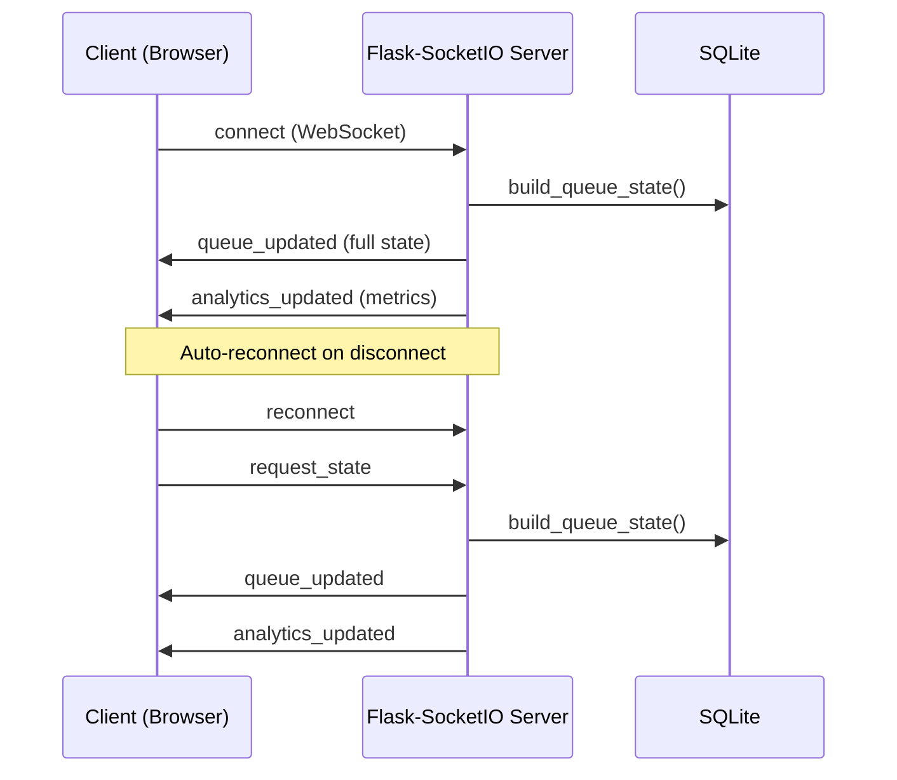
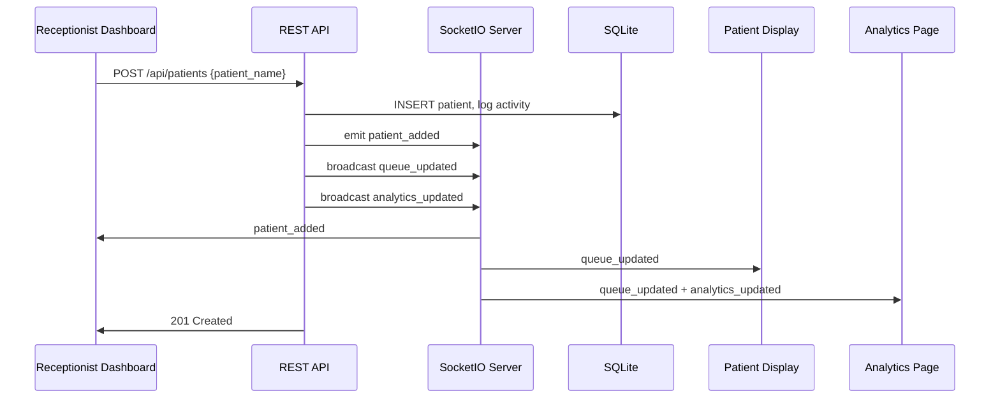
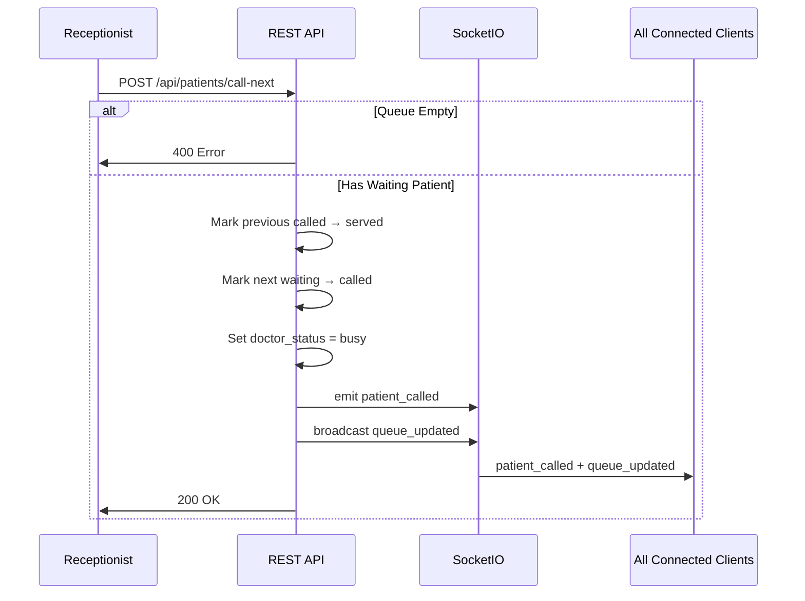
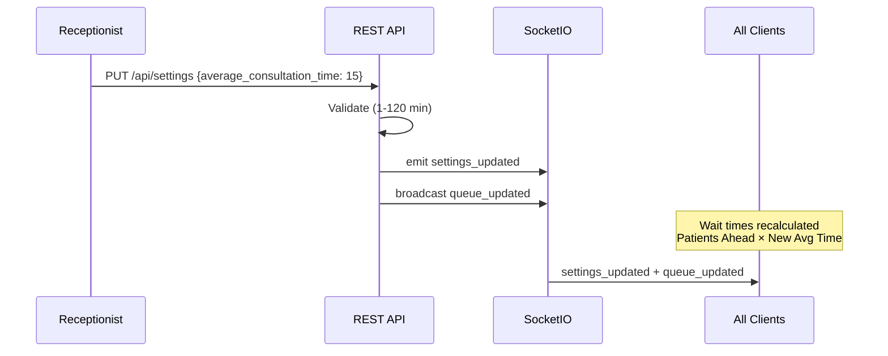
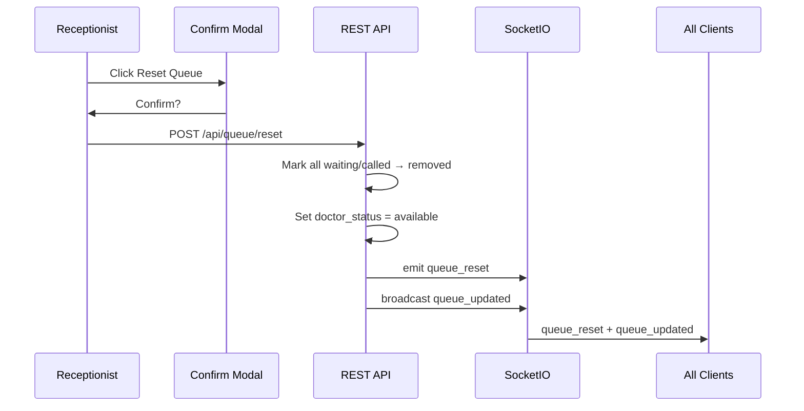

# Socket.IO Event Flow Diagram

## Connection Lifecycle



## Patient Added Flow



## Call Next Patient Flow



## Settings Updated Flow



## Queue Reset Flow



## Event Summary Table

| Event | Emitter | Payload | Subscribers |
|-------|---------|---------|-------------|
| `connect` | Client | — | Server responds with state |
| `request_state` | Client | — | Server sends full state |
| `queue_updated` | Server | Full queue state object | All pages |
| `patient_added` | Server | Patient object | Dashboard (toast) |
| `patient_removed` | Server | Patient object | Dashboard (toast) |
| `patient_called` | Server | Patient object | All pages (flash token) |
| `settings_updated` | Server | Settings object | Dashboard, Patient |
| `queue_reset` | Server | `{message}` | Dashboard (toast) |
| `analytics_updated` | Server | Analytics object | Analytics, Dashboard stats |

## State Object Structure (`queue_updated`)

```json
{
  "settings": {
    "average_consultation_time": 10,
    "doctor_status": "available",
    "clinic_name": "Queue Cure Clinic"
  },
  "waiting": [{ "id": 1, "token_number": 1, "patient_name": "...", "status": "waiting", ... }],
  "current": { "id": 2, "token_number": 2, "status": "called", ... },
  "history": [...],
  "activity": [{ "id": 1, "action": "...", "timestamp": "..." }],
  "analytics": { "patients_served_today": 5, "total_today": 8, ... },
  "waiting_count": 3,
  "estimated_wait_minutes": 30
}
```

## Client Reconnection Strategy

1. Socket.IO client configured with `reconnection: true`, infinite attempts
2. On `connect` event → emit `request_state`
3. Connection badge shows "Live" (green) or "Reconnecting..." (red)
4. No HTTP polling — WebSocket transport preferred, polling fallback only for handshake
